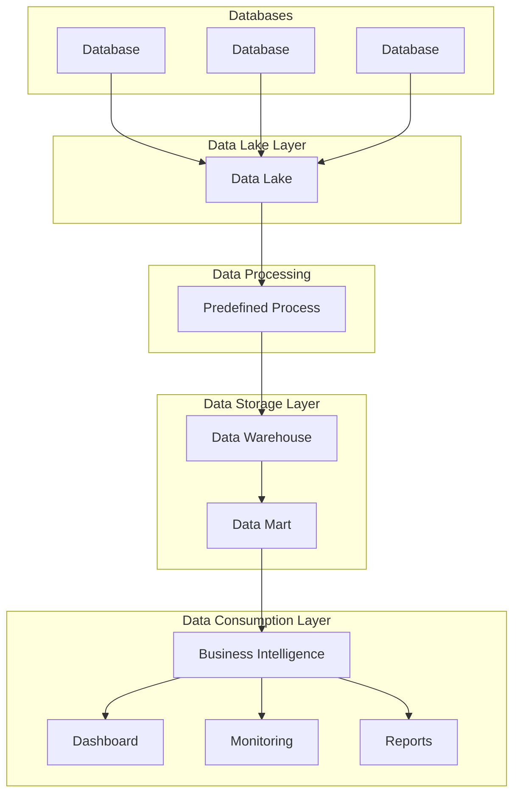
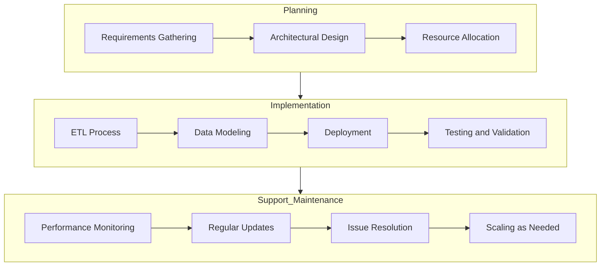
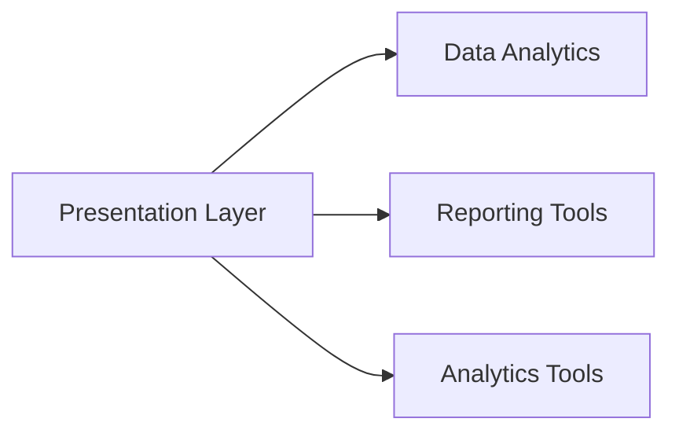
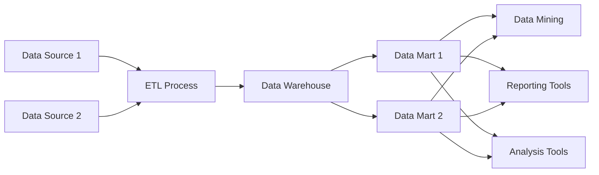
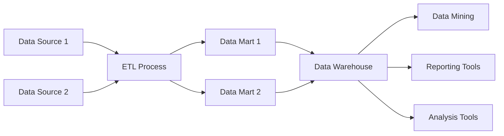

# What is a data Warehouse 
Data Warehouse is a computer system designed to store and analyze large amounts of data for an organization

A data warehouse is a centralized repository specifically designed to store, manage, and analyze large colums of structured and semi-structured data from multiple sources. it serves as a single source of trught for business intelligence (BI) and data analytics, enabling organizations to make data-driven decisions. 
Unlike transactional databases, which are optimized for day-to-day operations (e.g., processing sales or managing inventory), data warehouses are optimized for querying and reporting, making them ideal for analyzing historical data and uncovering trends. 

### Key Characteristics of a Data Warehouse.

1. Subject-oriented
   - Data is organized around key business subjects, such as sales, finance, customers, or inventory, rather than being application-oriented.
   - For example, a sales data warehouse would aggregate all sales data from multiple departments or regins 
2. Integrated
  - Combines data from diparate sources (e.g., ERP systems, CRM systmes, and external data feeds) into a consistent and unified format 

3.  Non-Volatile
  - Once data is loaded into a data warehouse, it is not frequently updated or modified. this ensures consistency for historical analysis 

4. Time-Variant
  - Data Warehouses store historical data to enable trend analysis, forecasting, and decision-making over time.
  - For example, you can compare sales figures from different years or track customer behaviour over months.

### How Does a Data Warehouse Work? 
1. Data Extraction:
  - Data is extracted from various sources, such as transactional databases, flat files, APIs, or external systems

2. Data Transfromation:
  - Extracted data is cleaned, standardized, and formatted to ensure consistency and remove duplicates
  - Example: converting different date formats ino a unified format

3. Data Loading:
  - The transformed data is loaded into a datawarehouse, this can be done in batches (batch processing) or in near real-time (real-time processing).

4. Data Storage:
  - The data is stored in a structured format, typically organized into tables, schemas, or dimensions (e.g., fact and dimensions in a star schema)

5. Data Access:
  - Users can query the data warehouse using SQL or access it through BI tools like Tableau, Power BI, or looker to create reports, dashboards, and visualizations.

### Arhitecture of a Data Warehouse 
1. Source systems:
  - These are the operational  systems where raw data originates, such as ERP systmes, CRM systems, and external APIs.

2. ETL/ELT Layer:
  - ETL (Extract, Transform, Load): Data is extraxted from source systems, transformed into a consistent format, and loaded into the data warehouse.
  - ELT (Extract, Load, Transform): Data is first loaded into the warehouse and the transformed within the warehouses.

3. Data Ware house:
  - The central repository where data is stored and managed.
  - can include specialized schemas like star schema or snowflake schema for organizing data.

4. BI and Analytics tools
- Tools that allow users to query, visiualize, and analyze data stored in the warehouse

# What Does a data warehouse do? 
- Gathers data from different areas of an organization
- integrates and stores data
- Make it available for analysis

A Data warehouse is designed to collect, store and manage large columes of data from multiple sources, making it easier for organizations to perform data analysis, generate reports, and make informed business decisions.
Here is a breakdown of the key functions and capabilities of a data warehouse: 

1. Consolidates Data from Multiple Sources:
  - A data warehouse integrates data from various sources, such as:
      - Databases (e.g., Transactional Systems, CRM, ERP)
      - External Sources (e.g., APIs, Spreadsheets, Social Media)
      - Cloud Platforms or loT devices
  - This consolidation eliminates data silos, creating a single, unified repository for data.

2. Provides a Centralized Data Repository
  - A Data warehouse acts as a single source of truth for the organization
  - All users and departments acces the same consisten, accurate, and cleaned data, ensuring alignment accross teams.

3. Stores Historical Data:
  - A Data warehouse is designed to store historical data (often spanning years), enabling organizations to track trends and analyze past performance.

4. Optimizes Data for Analytics:
  - Unlike transactional databases (e.g., used for daily operations), a data warehouse is optimized for complex queries, aggregations, and analytics
  - it allows for faster execution of queries used in reports, dashboards, and business intilligence (BI) tools

5. Scales with Business Needs
  - Modern Data warehouses, especially cloud-based ones (e.g., Snowflake, Google Bigwuery, Amazon Redshift), can scale to handle growing data volumes and workloads.

6. Provides Secure and Controlled Data Access
  - Data warehouse support role-based control (RBAC) to ensure that only authorized users can access specific datasets
  - Sensitive information can be encrypted or masked to comply with regulations 

    
# What is the difference between Data warehouses and Data lakes?

### Data Marts 
- A relational database for analysis
- Data is focused on  one subject area
- Few input data sources

### Data Lakes 
- Entire organization store of data
      - Contains data from many departments
      - many data input soruces
      - Typically > 100 GB in size
- Stores structured and unstructured data
     - Examples: viedo, audio and documents
- Less complex to make changes compared to data warehouses
      - Fewer upstream and downstream effects to consider
- Purpose to store data may not be known
      - Less organized

### Data Hierarchy Diagram


### Data Warehouse Life Cycle Diagram


#### Planning - business requirements 
1. Business Requirements:
   - Understanding the organizational needs
2. Data Modelling 
   - Planning and organizing on integrating data

#### Implementations
1. ETL Design
   - Implement data pipelines and ETL process
2. BI Application Development:
   - Set up business inteligence tools 
  
#### Support Maintenance 
1. Mainatenance:
   - Make any needed modifications
2. Test & Deploy
   - Testing
  

# What are the different layers of a data warehouse?

### The Presentation layer 
- Users interact with the presentation layer
   - Area of constant developement
 


#### Presentation Layer Groups: 
- Automated reporting / dashboarding tools
     - Goal:
     - Create reports needed for decision making
     - Create dashboards using historical data 
- BI/Data analytics
   - Goal:
   - Tools for exploration
   - Looking for patterns
- Direct Queries
   - Goal:
   - Sophisticated tools for exploration

# Data Warehouse Architectures 
### Top - Down 

1. Data warehouse
   - must decide:
        - On all data definitions, cleaning, and business rules
        - before any data enters warehouse


#### Pros and Cons of top-down 

Advantages: 
- single source of truth for organizations
- Normalization = Less storage
- Easy to change data marts to support reporting changes

Disadvantages: 
- More joins = slower response time
- Lengthy upfront work
- higher startup cost

### Kimball - bottom- up 
- Denormalizes data
- Focus on departmental data mart
- data moves directly from ETL to data marts 


#### Pros and cons of bottom-up 
Advantages: 
- upfront development speed
- lower startup costs
- Denormalized = user friendly

Disadvantages: 
- Increased ETL processing time
- Greater posibility of duplicate data
- Ongoing development needed

# OLAP and OLTP Systems 
## OLTP (Online Transaction Processing) 
### Purpose: 
- OLTP systems are designed for managing transactional data in real-time. They handle a large number of short, atomic operations such as insert, updates, and deletes. 

### Key Characteristics: 
- High Transaction Volume: Support many concurrent users performing transactions like placing orders or updating customer information 
- Normalized Data: Tables are usually normalized to minimize redundancy and optimize write performance 
- Low Latency: Prioritizes fast query processing for individual transactions 
- Data Scope: Focused on operational data like daily sales, inventory updates, or financial transactions. 

### Typical Queries 
- Insert, update, or delete records (e.g., a new customer or order) 
- Short, simple queries:
```sql
SELECT * FROM orders WHERE order_id = 12345; 
```
### Example use cases
- Banking systems: Processing withdrawals and deposits
- E-commerce Websites: Managing shopping Carts, inventory, and user profiles. 
- Ticket Booking Systems: Managing seat availability and reservations 

### Tools 
- Database: MySQL, PostgreSQL, Microsoft SQL Server, Oracle Database 
- Storage: Relational Database System with row-based storage. 

## OLAP (Online Analytical Processing) 
### Purpose: 
- OLAP systems are designed for data analysis and reporting. They support complex queries and aggregate data over large datasets. 

### Key Characteristics : 
- Complec Queries: Supports advanced queries like aggregations, groupings, and trends over time 
- Denormalized Data: Data is often stored in a denormilized format (e.g., star schema or snowflake schema) to optimize read performance 
- High Reader Performance: Optimized for fast reads and aggregations 
- Data Scope: Focused on historical and aggregated data used for decision-making

### Typical Queries 
- Aggregations, Summaries, and trend analysis: 
```sql
  		SELECT product_category, SUM(sales) AS total_sales
		FROM sales_data
		WHERE sale_date BETWEEN '2024-01-01' AND '2024-12-31'
		GROUP BY product_category;
```
### Example use cases
- Business intelligence: Sales trends, customer segmentation, and market analysis 
- Data Warehousing: Aggregating data from multiple OLTP systems for reporting
- Financial Analysis: Budget forcasting and profitability analysis 

### Tools
- Databases: Amazoon Redshift, Google Bigquery, Snowflake, Microsoft SQL Server 
- Storage: Columnar database systems, Data warehouses 


### Combining OLTP and OLAP
Organizations often integrate OLTP and OLAP systems: 
- Data Pipelines: Data from OLTP systems is periodically extracted, transformed, and loaded (ETL) into OLAP systems for analysis
- Real-Time Analytics: With modern tools like Appache Kafka and Cloud platforms, some systems combine OLTP andOLAP functionallyity for real-time-analytics 

# Data Warehouse Data modeling 
Data Warehouse Data Modelling refers to the process of designing the structure and organization of data within a data warehouse. This process focuses on how data is stored, organized, and retrieved effeciently to support analytical queries, business inteligence, and reporting. 

it is a critical step to build a data warehouse because it ensures that the data is well-structured, optimized for analytics, and aligned with business needs .

### Key Aspects of Data modeling
1. Purpose:
	- Organize data to enable easy retrieval and analysis
 - Ensure consistency, accuracy, and integrity of data
 - suport complex queries and reporting with minimal performance overhead.

2. Characteristics:
	- Optimized for read-heavy operations (queries, reporting)
 - stores historical data for trend analysis and decision-making
 - focuses on denormalized structures to reduce query complecity.

### Types of Data Models in Data Warehouse 
There are three primary types of data models used in data warehousing: 

1. Conseptual Data model
	- Provides a high-level overview of the data warehouse
	- Focuses on defining the entities, relationships, and business rules
	- Used to communicate with stakeholders and align with business goals.

2. Logical Data Model:
	- Details the data structure, including tables, attributes, and relationships.
	- Focuses on how data will be logically organized withoud considering physical implementation.

3. Physical Data Model
	- Specifies how the data will be physically stored in the database.
	- includes:
		- Database schema desing (e.g., star or snowflake schema)
		- Inedxing strategies for performance optimization
		- partitioning and clustering.

### Key Components of Data Warehouse Data Modeling. 
1. Fact Tables
	- Conatin measurable, quantitative data (e.g., sales, profit, number of orders)

2. Dimension Tables
	- Contain descriptive, categorical data that provides context to facts (e.g., product details, customer demographics)

3. Relationships
	- one-to-many: between fact tables and dimension tables

4. keys
	- primary key: unique identifier for each record in a table
	- Foreign key: Establishes relationships between fact and dimension tables.

### Steps in Data Warehouse Data Modeling
1. Understand Business Requirements:
	- Identify what data needs to be analyzed and reported.
	- Define metrics (facts) and dimensions needed to support these analyses.

2. Identify Fact and Dimension Tables:
	- Facts: Quantitative data like sales, revenue, and transactions.
	- Dimensions: Contextual data like product, customer, and time.

3. Choose the Schema:
	- Decide between a star, snowflake, or galaxy schema based on complexity, performance, and storage needs.

4. Design Logical and Physical Models:
	- Create ER diagrams (entity-relationship) for logical models.
	- Implement indexes, partitions, and clustering in physical models.

5. Validate and Optimize:
	- Test query performance.
	- Optimize indexing, partitioning, and denormalization as needed.

# ETL and ELT 

### Data Format Cleaning 

- Update values to an expected format
	- Dates
   	- Names of options
   	- Capitalization
- Ensures output is in a consistent format

### Adress Paring 

- Dividing a street adress into its components
- Can use tools to validate adresses

### Data Validation 

1. Range check
- Is the value within the expected range? 


2. Type Check
- Is the value the proper data type?

### Duplicate row elimination 
- This process gets rid of duplicate entries 
