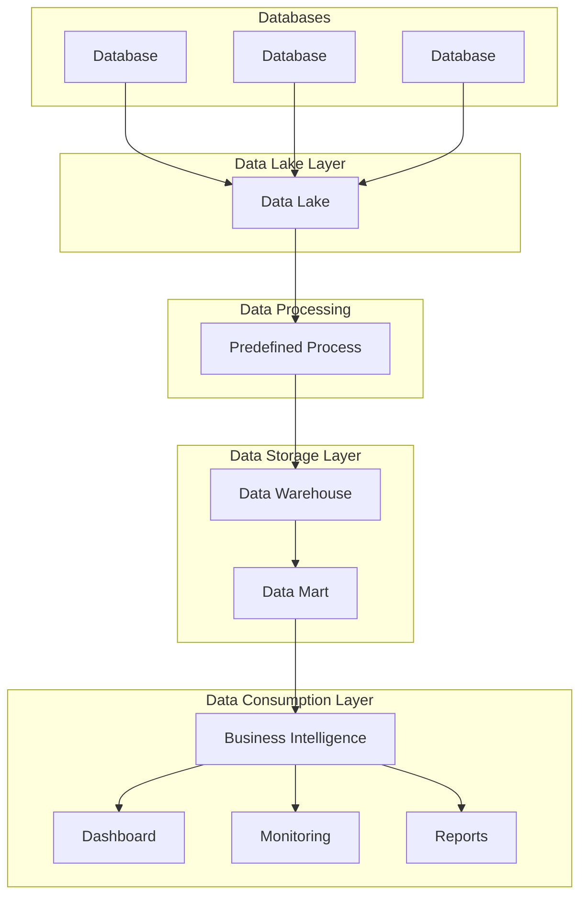

# What is a data Warehouse 
Data Warehouse is a computer system designed to store and analyze large amounts of data for an organization

A data warehouse is a centralized repository specifically designed to store, manage, and analyze large colums of structured and semi-structured data from multiple sources. it serves as a single source of trught for business intelligence (BI) and data analytics, enabling organizations to make data-driven decisions. 
Unlike transactional databases, which are optimized for day-to-day operations (e.g., processing sales or managing inventory), data warehouses are optimized for querying and reporting, making them ideal for analyzing historical data and uncovering trends. 

### Key Characteristics of a Data Warehouse.

1. Subject-oriented
   - Data is organized around key business subjects, such as sales, finance, customers, or inventory, rather than being application-oriented.
   - For example, a sales data warehouse would aggregate all sales data from multiple departments or regins 
2. Integrated
  - Combines data from diparate sources (e.g., ERP systems, CRM systmes, and external data feeds) into a consistent and unified format 

3.  Non-Volatile
  - Once data is loaded into a data warehouse, it is not frequently updated or modified. this ensures consistency for historical analysis 

4. Time-Variant
  - Data Warehouses store historical data to enable trend analysis, forecasting, and decision-making over time.
  - For example, you can compare sales figures from different years or track customer behaviour over months.

### How Does a Data Warehouse Work? 
1. Data Extraction:
  - Data is extracted from various sources, such as transactional databases, flat files, APIs, or external systems

2. Data Transfromation:
  - Extracted data is cleaned, standardized, and formatted to ensure consistency and remove duplicates
  - Example: converting different date formats ino a unified format

3. Data Loading:
  - The transformed data is loaded into a datawarehouse, this can be done in batches (batch processing) or in near real-time (real-time processing).

4. Data Storage:
  - The data is stored in a structured format, typically organized into tables, schemas, or dimensions (e.g., fact and dimensions in a star schema)

5. Data Access:
  - Users can query the data warehouse using SQL or access it through BI tools like Tableau, Power BI, or looker to create reports, dashboards, and visualizations.

### Arhitecture of a Data Warehouse 
1. Source systems:
  - These are the operational  systems where raw data originates, such as ERP systmes, CRM systems, and external APIs.

2. ETL/ELT Layer:
  - ETL (Extract, Transform, Load): Data is extraxted from source systems, transformed into a consistent format, and loaded into the data warehouse.
  - ELT (Extract, Load, Transform): Data is first loaded into the warehouse and the transformed within the warehouses.

3. Data Ware house:
  - The central repository where data is stored and managed.
  - can include specialized schemas like star schema or snowflake schema for organizing data.

4. BI and Analytics tools
- Tools that allow users to query, visiualize, and analyze data stored in the warehouse

# What Does a data warehouse do? 
- Gathers data from different areas of an organization
- integrates and stores data
- Make it available for analysis

A Data warehouse is designed to collect, store and manage large columes of data from multiple sources, making it easier for organizations to perform data analysis, generate reports, and make informed business decisions.
Here is a breakdown of the key functions and capabilities of a data warehouse: 

1. Consolidates Data from Multiple Sources:
  - A data warehouse integrates data from various sources, such as:
      - Databases (e.g., Transactional Systems, CRM, ERP)
      - External Sources (e.g., APIs, Spreadsheets, Social Media)
      - Cloud Platforms or loT devices
  - This consolidation eliminates data silos, creating a single, unified repository for data.

2. Provides a Centralized Data Repository
  - A Data warehouse acts as a single source of truth for the organization
  - All users and departments acces the same consisten, accurate, and cleaned data, ensuring alignment accross teams.

3. Stores Historical Data:
  - A Data warehouse is designed to store historical data (often spanning years), enabling organizations to track trends and analyze past performance.

4. Optimizes Data for Analytics:
  - Unlike transactional databases (e.g., used for daily operations), a data warehouse is optimized for complex queries, aggregations, and analytics
  - it allows for faster execution of queries used in reports, dashboards, and business intilligence (BI) tools

5. Scales with Business Needs
  - Modern Data warehouses, especially cloud-based ones (e.g., Snowflake, Google Bigwuery, Amazon Redshift), can scale to handle growing data volumes and workloads.

6. Provides Secure and Controlled Data Access
  - Data warehouse support role-based control (RBAC) to ensure that only authorized users can access specific datasets
  - Sensitive information can be encrypted or masked to comply with regulations 

    
# What is the difference between Data warehouses and Data lakes?

### Data Marts 
- A relational database for analysis
- Data is focused on  one subject area
- Few input data sources

### Data Lakes 
- Entire organization store of data
      - Contains data from many departments
      - many data input soruces
      - Typically > 100 GB in size
- Stores structured and unstructured data
     - Examples: viedo, audio and documents
- Less complex to make changes compared to data warehouses
      - Fewer upstream and downstream effects to consider
- Purpose to store data may not be known
      - Less organized

### Data Hierarchy Diagram


### Data Warehouse Life Cycle Diagram

```mermaid
graph TD
    subgraph Planning
        Req[Requirements Gathering]
        Arch[Architectural Design]
        Res[Resource Allocation]
    end

    subgraph Implementation
        ETL[ETL Process]
        DataModel[Data Modeling]
        Deployment[Deployment]
        Testing[Testing and Validation]
    end

    subgraph Support_Maintenance
        Monitoring[Performance Monitoring]
        Updates[Regular Updates]
        IssueFix[Issue Resolution]
        Scalability[Scaling as Needed]
    end

    %% Connecting Phases
    Planning --> Implementation
    Implementation --> Support_Maintenance

    %% Connecting Steps within Phases
    Req --> Arch
    Arch --> Res
    ETL --> DataModel
    DataModel --> Deployment
    Deployment --> Testing
    Monitoring --> Updates
    Updates --> IssueFix
    IssueFix --> Scalability

